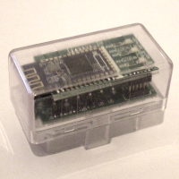

## Project Description

.NET BMW and VAG Ediabas interpreter library

# Features
This .NET assembly is small and fast replacement for the BWM and VAG Ediabas toolset.  
It's running on all platforms that support .NET framework (Windows, Windows CE, Mono).  
The code is speed optimized, but improved for multiple calls of the same job.  
This means the first job call is slow and the next are faster.

The library can directly read and interpret .GRP and .PRG files, the internal interface is similar to the EDIABAS API or the Tool32.exe GUI interface.  
At the moment the D-CAN, BMW-FAST, KWP-2000*, KWP-2000 BMW, DS2, DS1, Concept 3, ISO9141 (Concept 2) and Concept 1 concepts are supported. If you send me EDIABAS log files from other concepts I could add them if possible.  
Now a variant that can be used with cars from the VAG group has been released, but it requires an adapter with the [Replacement firmware for ELM327](docs/Replacement_firmware_for_ELM327.md). In this mode, the protocols KWP2000, KWP1281 and TP2.0 are supported (cars until 4.2012).  

For testing, there is a console application [EdiabasTest](docs/EdiabasTest_parameters.md) with command line parameters.

**More informations could be found in the [Documentation](docs/Documentation.md) section.**  
**These are expert tools, I have no time for detailed support. Please search the internet for _EDIABAS_, _Tool32_, _INPA_, _ISTA-D_, _ISTA-P_ e.g. or use forums to get help.**

If you want to support the development you could donate a small amount.  

# Binary Compatibility
A binary compatible api32.dll wrapper is existing, it's possible to replace the existing EDIABAS api32.dll with the EdiabasLib api32.dll and the applications are still working (The dll requires [.NET framework 4.7.2](https://www.microsoft.com/de-de/download/details.aspx?id=17718) or higher and [VS2015 C++ runtime](https://www.microsoft.com/de-de/download/details.aspx?id=48145) to be installed)!  
This has been tested with Tool32, INPA and Rheingold. Since EdiabasNet is ignoring the EDIABAS.INI file you have to put your own EdiabasLib.config in the api32.dll directory.

A compatible apiNET32.dll is also available, so it should be easy to port existing .NET applications that use the original EDIABAS library.

# Android
Now there is also a library existing that is working with Mono for Android. For communication, either FTDI USB or Bluetooth Serial Port Protocol (SSP) protocol could be used.

### Deep OBD
Additionally an Android application _[Deep OBD](docs/Deep_OBD_for_BMW_and_VAG.md)_ is existing, that is configurable via [XML](docs/Page_specification.md). Generation of XML code could be simplified with the integrated configuration generator.  
Download app from Google Play: [https://play.google.com/store/apps/details?id=de.holeschak.bmw_deep_obd](https://play.google.com/store/apps/details?id=de.holeschak.bmw_deep_obd)  
 Rated by updatestar.com: [https://deep-obd.updatestar.com](https://deep-obd.updatestar.com)  

_Deep OBD for BMW and VAG_ supports several OBD II adapters:
* Standard FTDI based USB "INPA compatible" D-CAN/K-Line adapters (all protocols)
* ELM327 Bluetooth and WiFi adapters based on PIC18F2480 microcontroller (no MCP2515 chip). Recommended ELM327 versions are 1.4b, 1.5 and origin 2.1. (D-CAN protocol only)
* ELM327 Bluetooth adapters based on PIC18F25K80 microcontroller with [Replacement firmware for ELM327](docs/Replacement_firmware_for_ELM327.md) D-CAN and K-Line (all protocols, including VAG KWP2000, KWP1281 and TP2.0). Programmed adapters are now available.

More details could be found here: [Supported adapter types](docs/AdapterTypes.md)

* Custom [Bluetooth D-CAN/K-Line adapter](docs/Build_Bluetooth_D-CAN_adapter.md) (BMW-FAST protocol over D-CAN and K-Line)
* [ENET WiFi adapters](docs/ENET_WiFi_Adapter.md) (for BMW F-models)

  
 

### Android Auto
[Android Auto](docs/Deep_OBD_for_BMW_and_VAG.md#android-auto) is now available in the release version of _[Deep OBD](docs/Deep_OBD_for_BMW_and_VAG.md)_.

# Hints
At the moment most BEST/1 commands are implemented, but a few are still missing, which seem to be not required in the current ECU files.  
The implemented commands are automatically tested and compared with EDIABAS output.  
