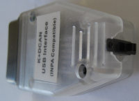
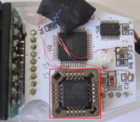
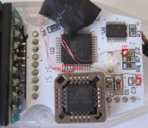
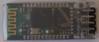
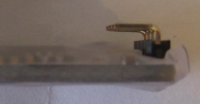
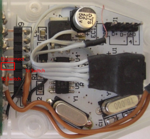
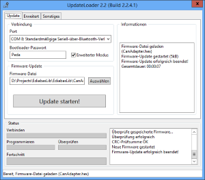

# Build a Bluetooth - D-CAN/K-Line Adapter
**To build a Bluetooth adapter now use the [Replacement firmware for ELM327](Replacement_firmware_for_ELM327.md) instead!**  
You could still use the firmware as a replacement for FTDI based adapters (Only [Steps 1](#step1-replace-the-pld) and [Steps 2](#step2-program-the-processor) is required, the [firmware update](#firmware-update) is also possible).

This chapter describes how to build a D-CAN/K-Line adapter with bluetooth support.  
**This firmware is not supported any more, use it at your own risk!**

There is also an external [flashing manual](https://www.sfbmwcoding.com/files/flashing_compatible_cable_ediabaslib.pdf) available.

Basically two components are required:
* A standard D-CAN/K-Line Adapter. There are multiple manufactures who sell such adapters which are basically identical. I have used one with a PLCC AFT16V8B, because it's easier to replace the chip.
* A HC-05 bluetooth board. It's important that it has an integrated 5V to 3.3V power regulator.
## Step1: Replace the PLD
A big problem of the standard adapters is the high power consumption which results in a very high inner temperature. The main reason for this is the used PLD type. The ATF16V8B requires 50mA in standby. It's possible to replace this chip with a ATF16V8BQL type, which only requires 5mA. You could remove the existing PLD with hot air and attach a PLCC20 socket instead. With a PLC programmer program the `custom.jed` file into the ATF16V8BQL (The `standard.jed` file is the original program). The custom program adds an additional RXD input to the unused pin 1.

## Step2: Program the processor
There is a [replacement firmware](https://github.com/uholeschak/ediabaslib/releases/latest) available that has the following advantages over the standard firmware:
* Faster CAN communication (block size 0 and no separation time).
* Allows configuration of CAN mode all the time, not only after power on.
* Allows configuration of the CAN parameters (block size and separation time)
* Correctly displays the ignition status (only available for K-line mode).
* Allows to read the ignitions status with a telegram, this is required if you want to communicate over bluetooth.
* Contains a bootstrap loader that allows firmware update without opening the device.
* Reduced power consumption due to use of sleep mode.

For the first programming of the new firmware you have to connect the MISO, MOSI, SCK, RESET, GND and +5V to a standard AVR programmer (also supply the adapter with 12V). The `combined.hex` file contains the bootstrap loader and the firmware. The fuses have to be set as follows:

| Fuse | Value (hex) |
| ---- | ----------- |
| Low | 0xFD |
| High | 0xDC |
| Extended | 0xF9 |

Next time the firmware update is possible with `UpdateLoader.exe` (using `CanAdapter.hex`).

## Step3: HC-05 connector
Now it's time to add an connector for the HC-05 board. The board requires only GND, +5V, TXD and RXD. But be beware of one problem: The HC-05 operates with 3.3V logic, whereas the converter uses 5V. For TXD signal (output from HC-05) this is no problem, the high level is detected correctly by the ATF16V8, but the RXD signal generated by the ATF16V8 has be be adjusted.  
I have used a voltage divider with 1K and 2K connected to ground. The HC-05 TXD signal could be now connected the Pin1 of the PLD (when using the `custom.jed` file).

## Step4: HC-05 configuration
The HC-05 has now to be set into the correct operation mode. Connect it to an USB-TTL converter and attach the KEY pin to 3.3V or press the button on the board (depends on board type) during power on.  
Use a terminal program with the following parameters: Baud 38400, 8, N, 1. Make sure that all commands are terminated with `<CR><LF>`! Now test the connection with the command: `AT<CR><LF>`. The device must respond with `OK<CR><LF>`. Now use the following commands to set the operation mode (also see HC-05 specification):
* Role slave: `AT+ROLE=0"`
* Baud rate: `AT+UART=115200,0,0`
* Device name: `AT+NAME=<Your device name>`
* Password: `AT+PSWD=<Your password>`

## Step5: Replace HC-05 pin header
The pin header of the HC-05 board normally point into the wrong direction, so it will not fit into the adapter case. Remove the pin header and replace it with a new one that points into the opposite direction. Additionally you may have to replace the shrinking tube.

 

## Step6: Add a power switch
If you want to leave the adapter plugged into the OBDII socket, you need a possibility to switch it off. You have to disconnect the pin header as shown in the picture below and add a switch that could be mounted in the empty USB cable space.

## Step7: Mount everything together
Plug the modified HC-05 into it's socket and close the adapter. You should now be able to connect to the adapter via bluetooth from the PC. Make sure you are using a bluetooth chip in the PC and not a USB-TTL converter with HC-05 in master role because this will result in incorrect timing!  
When sending strings to the adapter you should at least get an echo from the adapter, otherwise there is a problem with the connections.  
You could test reading the ignition pin with the following command (hex values):  
`82 F1 F1 FE FE 60`  
The response is (additionally to the echo):  
`82 F1 F1 FE <state> <checksum>` with state bit 0 set to 1 if ignition is on.  

# Firmware update
With `UpdateLoader-win32.exe` (application is only in german language) it's possible to update the firmware via bluetooth. Simply select the COM port and the hex file (`CanAdapter.hex`, not `Combined.hex`!) and start update.  
The update can only be initiated if there is a valid application in the adapter. When the update via bluetooth is not possible any more, connect the adapter via USB, start the update process and power on the adapter (12V).

# FTDI FT232RL 3V3OUT design problem
Some D-CAN cables have a design mistake and the 100nF capacitor is missing at the 3V3OUT.  
Before adding the recommended capacitor to the 3V3OUT pin there is ca. 400mV of ripple at the 3V3OUT, after adding the cap there is no ripple.  

**From the FTDI FT232RL datasheet:**  
Name: 3V3OUT  
Type: Output  
+3.3V output from integrated LDO regulator. This pin should be decoupled to ground using a 100nF capacitor. The main use of this pin is to provide the internal +3.3V supply to the USB transceiver cell and the
internal 1.5 KOhm pull up resistor on USBDP.  
Up to 50mA can be drawn from this pin to power external logic if required. This pin can also be used to supply the VCCIO pin.

# Atmel PB4 overvoltage problem
OBD pin 1 go to R6 1K and then the Atmega PB4, in parallel with this is R5 47K to ground.  
This creates a voltage divider that reduces the 12V to 11.75V, the absolute maximum rating is 5.5V for the Atmega.  
A possible solution is to move the 47K resistor to R6 and then replaced R5 with a 18K resistor.
