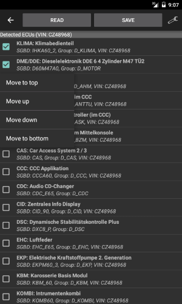
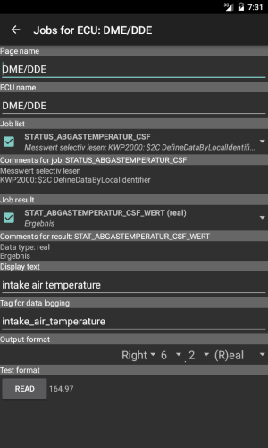

# Configuration generator
The configuration generator is a tool that simplifies generation of [XML configuration files](Page_specification.md).  
The generator options menu has the following entries:
* _Interface_: If a configuration has been loaded on the main page, the same communication interface is also used by the generator as default. With this menu entry a different communication interface could be selected.  
For testing without a vehicle, the interface type _Simulation_ has to be selected. In this case selection of a valid simulation directory containing `.sim` files is also required.
* _Simulation directory_: If the interface type _Simulation_ has been selected, this menu entry allows to select the simulation directory.  
If no [simulation files](EdiabasLib.simulation_file.md) are present in the selected directory, the checkbox is unset and the communication is disabled.
* _Adapter_: With this menu the [Bluetooth adapter](Deep_OBD_for_BMW_and_VAG.md#supported-adapters) could be selected. If the device is not coupled already, searching for new devices is possible. This menu is only enabled if interface type _BLUETOOTH_ has been selected.
* _Adapter configuration_: When using a FTDI USB, Bluetooth or WiFi (with the [Replacement firmware for ELM327](Replacement_firmware_for_ELM327.md)) adapter this menu allows the adapter configuration. Depending on the adapter type only the CAN baudrate/K-Line interface or more specific parameters could be specified.
* _Add errors page_: When this checkbox is selected (which is the default) an _Errors_ page will be generated when writing the configuration file. This page will read the error memory of all detected ECUs.
* _Detect motorbikes_: Activates special detection telegrams for motorbikes. This is not enabled by default and slows down normal car detection.
* _Configuration_: With this submenu you could select if the configuration is created automatically or manually:
	* _Automatic_: The ECU configuration will be read from the vehicle with the _Read_ button. This option is only available in BMW mode.
	* _Manual X_: A manual configuration is stored in the storage with the number X. The ECUs for the configuration have to be added manually with the submenu from the _Edit_ button. Therefore you have to identify the required `.GRP` or `.PRG` files on the info page of each ECU in INPA.

`.GRP` file name is `D_MOTOR.GRP` and `.PRG` file name is `D60M47A0.PRG`
* _Data logging_: Selecting this menu entry will open a sub menu with multiple data logging options:
	* _Create trace file_: If the checkbox of this menu is active, a `ifh.trc` file will be created when executing jobs. The trace file will be created in the `LogConfigTools` subdirectory.
	* _Append trace file_: If this checkbox is enabled the trace file is always appended. Otherwise the trace file will be overridden after selection of a vehicle type.
* _Translations_: (Only for non German languages and BMW mode) This menu opens a submenu that allows configuration of automatic ECU text translation with Yandex.Translate:
	* _Translate ECU text_: If this menu item is checked, automatic ECU text translation is active.
	* _Translation configuration_: For automatic translation with various translation providers. For translation a (free) API Key is required. This menu assists to select and configure a translation provider.
	* _Clear translation cache_: The translations are stored together with the ECU configuration files. To enforce a new translation this menu resets the translation cache.
* _Online help_: Displays this help page.

The vehicle type is detected automatically when pressing the _Read_ button (_automatic mode_).  
If the _manual mode_ is used this button is named _Edit_ and opens a submenu that allows to add or remove ECU files. Therefore you have to identify the required `.GRP` or `.PRG` files on the info page of each ECU in INPA. In VAG mode it's possible to search for ECUs, but this process is very time consuming.

If the analysis is successful, the detected ECUs are listed and the VIN is displayed in the title bar. The VIN will later be used as subdirectory name for storing the generated configuration.  
If an ECU is completely silent (defective) it will not show up in the list!  
After selecting an ECU list entry it's Job page will be displayed. This is the main configuration page for the jobs results that will be added to the configuration file.  
The page has the following properties:
* _Search field_: With the search field in the title bar it's possible to filter jobs and results that match the filter text.  
It's either possible to filter the jobs or the results, depending from last selected item type (job or result).  
When changing the item type, the search filter is cleared and closed.
* _Page name_: This is the title (tab) name for the page in the configuration file.
* _ECU name_: With this field the name of ECU on the _Errors_ page could be changed.
* _Display type_: With his check box a graphical (gauge) display for the results could be enabled. The result will be only displayed if _Graphical design_ is set to value other than hidden.
* _Font size_: The font size of the displayed data on the main page could be specified in 3 steps (_Small_, _Medium_ and _Large_).
* _Job list_: Here all available jobs are listed. Only if the job has a check mark it will be executed later. In the area _Comments for job_ the comments for the selected job will be shown.  
 If the BMW database is used, only the known jobs are listed by default. Activating the option _show all jobs_ will display all jobs.
* _Job result_: Here one more more job results could be selected (with a check mark) that will be displayed later on the page) For the currently selected result the data type and comment will be shown below.
* _Display text_: This is the text that will be displayed on the page beside the job result.
* _Display order_: Here the index of the display order could be specified. The default value is 0. If two values are identical, the original order is retained.
* _Graphical design_: If _Display type_ is set to _Graphical display_ this settings will get visible. The following design types are available:
    * _Hidden_: The result will not be displayed. If the result value type is not `integer` or `real` this is the only option.
    * _Simple gauge square_: A simple gauge with square border will be displayed.
    * _Simple gauge round_: A simple gauge with round border will be displayed.
    * _Simple gauge with dot_: A simple gauge with round border and a dot instead of bar graph will be displayed.

    For the gauge display the value range _min value_ and _max value_ has to be specified also.
* _Tag for data logging_: If the _Log data_ option is enabled on the main page the result data will get this tag in the log file. If the entry is empty no data will be logged.
* _Output format_: Here the output format of the result data could be modified. The format specification is in the form of [Ediabas result types and formats](EDIABAS_result_types_and_formats.md). Depending on the job data type more or less result types will be listed.
* _Read_: This button executes the selected job and displays the result in the specified format next to the button.
* _Search results_: If the result list for a job becomes too large, the results could be filtered with the search widget of the title bar.
* _Additional functions_: If available in this area some special functions are displayed.
  * _Ediabas tool_: This button switches directly to the [EDIABAS tool](EdiabasTool.md) with the current SGBD loaded.
  * _Actuator functions_: (BMW only) Known actuator functions from the BMW database could be executed directly.
  * _Coding_: (VAG only) Execute coding functions.
  * _Coding 2_: (VAG only) Execute coding 2 functions.
  * _Adaption_: (VAG only) Execute adaption functions.
  * _Login_: (VAG only) Execute login functions.
  * _Security access_: (VAG only) Execute security access functions.

With the _Save_ button on the main configuration page the configuration will be stored and used as default on the main page.
Hint: A long click on the ECU list opens a submenu that allows to change the order of the ECU entries in the list.

 
