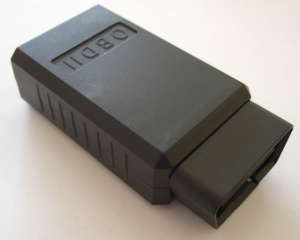
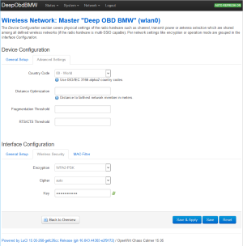
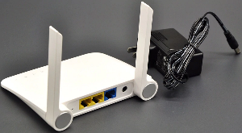
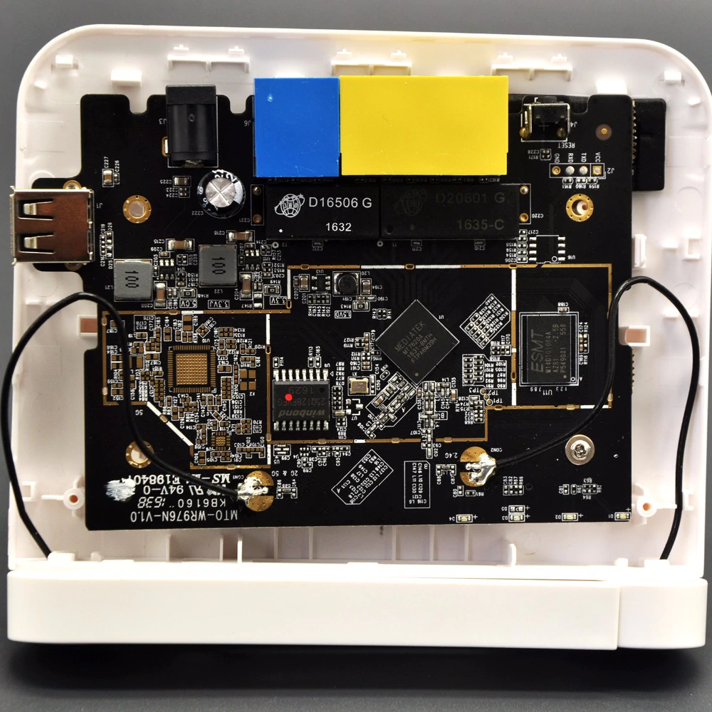
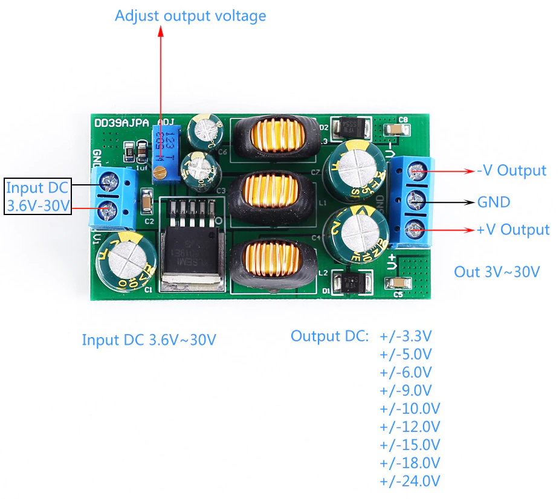
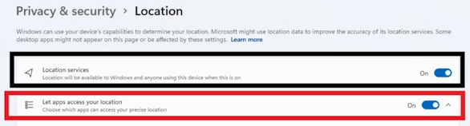
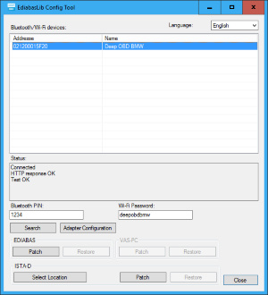

# ENET WiFi Adapter
For the BMW F-series or higher there **was** a WiFi adapter available, that allows to communicate directly using the BMW ENET protocol.  
It is based on the hardware of an [A5-V11 3G/4G Router](https://wiki.openwrt.org/toh/unbranded/a5-v11). The adapter has the following features:
* MediaTek/Ralink RT5350F processor with 350MHz
* DC/DC converter for improved power consumption
* With additional CPU heat sink for over temperature protection
* [OpenWrt](https://openwrt.org/) operating system
* [LuCi](http://luci.subsignal.org/trac) web interface
* Firmware update possible via web interface
* DHCP server
* ESSID: Deep OBD BMW
* Default Wifi password: deepobdbmw
* Default IP address: 192.168.100.1
* Default root password: root
* The adapter has been redesigned with a smaller housing.

  

## Alternative WiFi adapter
Since the adapter is no longer available, there are some commercial alternatives:  
**modBM**: [modBM Wifi ENET adapter](https://modbm.com/shop/wifi-enet/) which also uses the [A5-V11 3G/4G Router](https://wiki.openwrt.org/toh/unbranded/a5-v11).  
**Unichip**: Unichip ENET WiFi adapter (historical). It's recommended to load the settings of the `EnetWifiSettings.dat` configuration file into the adapter. The default configuration password of these adapters was `Nichip@_^1755`.  
For BMW pre F-series use the [Bluetooth adapter](Replacement_firmware_for_ELM327.md)

## Adapter cable
You could also use an ENET adapter cable, in this case you have to configure the Android LAN adapter with an Auto IP address (APIPA address),
for example `169.254.1.10 / 255.255.0.0`.  
This is required because the vehicle will not get a DHCP address and will fall back to Auto IP address mode.  
When using Ethernet as vehicle connection Yantex translation is not available because Android always tries to use Ethernet as internet connection (which is not available in this case).  

Another solution is to use an OpenWrt WiFi router (e.g. `MT7620A`), update the firmware from the manufacturer and connect the cable to one of the LAN ports (not WAN) of the router.  
A buck-boost 12V DC-DC converter (e.g. `DD39AJPA` from eletechsup and adjust the output voltage to 12V) is required for power supply.  
The router has to be configured with ESSID `Deep OBD BMW` and IP address `192.168.100.1`. For encryption use `WPA2-PSK` and specify a key (The default key is `deepobdbmw`).

  
  

## Factory reset
If the adapter gets unreachable after a misconfiguration there is a possibility to perform a factory reset.  
You have to open the adapter and press the reset button after the adapter has booted.

## Use the adapter with INPA, Tool32 or ISTA-D
You could use the ENET WiFi adapter on a windows PC with INPA, Tool32 or ISTA-D as a replacement for an ENET adapter cable. The following steps are required to establish the connection:
* Install [.NET Framework 4.8 Runtime](https://dotnet.microsoft.com/en-us/download/dotnet-framework/net48) or higher, [.NET 8.0 Desktop Runtime](https://dotnet.microsoft.com/en-us/download/dotnet/8.0),  
and [VS C++ Runtime 64 bit](https://aka.ms/vs/17/release/vc_redist.x64.exe) or [VS C++ Runtime 32 bit](https://aka.ms/vs/17/release/vc_redist.x86.exe).
* For Windows 11: Allow location access for all apps in the system settings to enable WiFi access. 
* Optionally connect the ENET adapter with the PC. The PC automatically gets an IP address from the adapter DHCP server.
* If the vehicle is connected directly to your local network (with a DHCP server present) the vehicle will get an IP address from the DHCP server.
* Download the [latest binary](https://github.com/uholeschak/ediabaslib/releases/latest) package and extract the .zip file. Start `EdiabasLibConfigTool\EdiabasLibConfigTool.exe` and follow the instructions in the status window: Search the adapter, select it, optionally click `Connect`, click `Check Connection` and patch the required EDIABAS installations.
* For ISTA-D: You have to select the `EDIABAS\bin` directory inside ISTA-D first.
* Optionally you could also open the adapter configuration page in the web browser.
* For ISTA-D: In `Administration` -> `VCI Config` select as `Interface type`: `Ediabas default settings (ediabas.ini)`  
For programming the option 'HO-ICOM / ENET local network' is required.  This option is only working with LAN and not with D-CAN connections!

