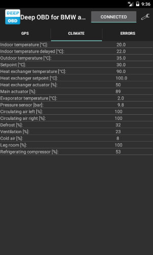
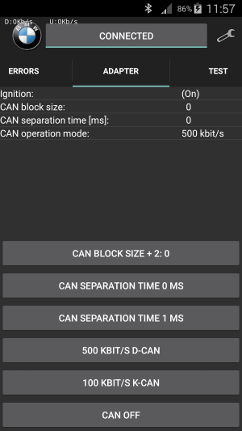

# Defining pages for _Deep OBD for BMW and VAG_
Each page (tab) is defined in a single XML (`*.ccpage`) file. A general documentation of all XML tags could be found in the `BmwDeepObd.xsd` file. The documentation will be displayed in the XML editor when the `.xsd` is added as `xs:shema` in the XML file.  
Table of contents:
* [Simple jobs](#simple-jobs)
* [Reading errors](#reading-errors)
* [User defined code](#user-defined-code)
	* [Formatting results (FormatResult)](#formatting-results-formatresult)
	* [Formatting error results (FormatErrorResult)](#formatting-error-results-formaterrorresult)
	* [Control output of the page (UpdateResultList)](#control-output-of-the-page-updateresultlist)
	* [Executing own jobs (ExecuteJob)](#executing-own-jobs-executejob)
	* [Adding controls to the layout](#adding-controls-to-the-layout)
* [Grouping pages](#grouping-pages)
* [The configuration file](#the-configuration-file)
* [Broadcasts](#broadcasts)

## Simple jobs
If only some EDIABAS jobs with fixed arguments are required for one display page, the XML code is relative simple. Below is the example code to display climate data for a E61 vehicle:
``` xml
<?xml version="1.0" encoding="utf-8" ?>
<fragment xmlns="http://www.holeschak.de/BmwDeepObd"
          xmlns:xsi="http://www.w3.org/2001/XMLSchema-instance"
          xsi:schemaLocation="http://www.holeschak.de/BmwDeepObd ../BmwDeepObd.xsd">
  <page name="tab_ihk" fontsize="medium">
    <strings>
      <string name="tab_ihk">Climate</string>
      <string name="label_ihk_in_temp">Indoor temperature [°C](°C):</string>
      <string name="label_ihk_in_temp_delay">Indoor temperature delayed [°C](°C):</string>
      <string name="label_ihk_out_temp">Outdoor temperature [°C](°C):</string>
      <string name="label_ihk_setpoint">Setpoint [°C](°C):</string>
      <string name="label_ihk_heat_ex_temp">Heat exchanger temperature [°C](°C):</string>
      <string name="label_ihk_heat_ex_setpoint">Heat exchanger setpoint [°C](°C):</string>
      <string name="label_ihk_heat_ex_actuator">Heat exchanger actuator [%](%):</string>
      <string name="label_ihk_main_actuator">Main actuator [%](%):</string>
      <string name="label_ihk_evap_temp">Evaporator temperature [°C](°C):</string>
      <string name="label_ihk_press_sense">Pressure sensor [bar](bar):</string>
      <string name="label_ihk_circ_air_left">Circulating air left [%](%):</string>
      <string name="label_ihk_circ_air_right">Circulating air right [%](%):</string>
      <string name="label_ihk_defrost">Defrost [%](%):</string>
      <string name="label_ihk_vent">Ventilation [%](%):</string>
      <string name="label_ihk_cold_air">Cold air [%](%):</string>
      <string name="label_ihk_legroom">Leg room [%](%):</string>
      <string name="label_ihk_refrig_comp">Refrigerating compressor [%](%):</string>
    </strings>
    <strings lang="de">
      <string name="tab_ihk">Klima</string>
      <string name="label_ihk_in_temp">Innentemperatur [°C](°C):</string>
      <string name="label_ihk_in_temp_delay">Innentemperatur verzögert [°C](°C):</string>
      <string name="label_ihk_out_temp">Außentemperatur [°C](°C):</string>
      <string name="label_ihk_setpoint">Sollwert [°C](°C):</string>
      <string name="label_ihk_heat_ex_temp">Wärmetauschertemperatur [°C](°C):</string>
      <string name="label_ihk_heat_ex_setpoint">Wärmetauschersollwert [°C](°C):</string>
      <string name="label_ihk_heat_ex_actuator">Wärmetauscherstellgröße [%](%):</string>
      <string name="label_ihk_main_actuator">Hauptstellgröße [%](%):</string>
      <string name="label_ihk_evap_temp">Verdampfertemperatur [°C](°C):</string>
      <string name="label_ihk_press_sense">Drucksensor [bar](bar):</string>
      <string name="label_ihk_circ_air_left">Umluft links [%](%):</string>
      <string name="label_ihk_circ_air_right">Umluft rechts [%](%):</string>
      <string name="label_ihk_defrost">Abtauen [%](%):</string>
      <string name="label_ihk_vent">Belüftung [%](%):</string>
      <string name="label_ihk_cold_air">Kaltluft [%](%):</string>
      <string name="label_ihk_legroom">Fußraum [%](%):</string>
      <string name="label_ihk_refrig_comp">Kältemittelverdichter [%](%):</string>
    </strings>
    <jobs sgbd="d_klima">
      <job name="STATUS_REGLERGROESSEN" results="STAT_TINNEN_WERT;STAT_TINNEN_VERZOEGERT_WERT;STAT_TAUSSEN_WERT;STAT_SOLL_LI_KORRIGIERT_WERT;STAT_WT_RE_WERT;STAT_WTSOLL_RE_WERT;STAT_YWT_RE_WERT;STAT_Y_RE_WERT">
        <display name="label_ihk_in_temp" result="STAT_TINNEN_WERT" format="6.1R" />
        <display name="label_ihk_in_temp_delay" result="STAT_TINNEN_VERZOEGERT_WERT" format="6.1R" />
        <display name="label_ihk_out_temp" result="STAT_TAUSSEN_WERT" format="6.1R" />
        <display name="label_ihk_setpoint" result="STAT_SOLL_LI_KORRIGIERT_WERT" format="6.1R" />
        <display name="label_ihk_heat_ex_temp" result="STAT_WT_RE_WERT" format="6.1R" />
        <display name="label_ihk_heat_ex_setpoint" result="STAT_WTSOLL_RE_WERT" format="6.1R" />
        <display name="label_ihk_heat_ex_actuator" result="STAT_YWT_RE_WERT" format="3L" />
        <display name="label_ihk_main_actuator" result="STAT_Y_RE_WERT" format="3L" />
      </job>
      <job name="STATUS_ANALOGEINGAENGE" results="STAT_TEMP_VERDAMFER_WERT;STAT_DRUCKSENSOR_WERT">
        <display name="label_ihk_evap_temp" result="STAT_TEMP_VERDAMFER_WERT" format="6.1R" />
        <display name="label_ihk_press_sense" result="STAT_DRUCKSENSOR_WERT" format="6.1R" />
      </job>
      <job name="STATUS_MOTOR_KLAPPENPOSITION" results="STAT_FRISCHLUFT_UMLUFT_LI_WERT;STAT_FRISCHLUFT_UMLUFT_RE_WERT;STAT_DEFROST_WERT;STAT_BELUEFTUNG_WERT;STAT_KALTLUFT_WERT;STAT_FUSSRAUM_WERT">
        <display name="label_ihk_circ_air_left" result="STAT_FRISCHLUFT_UMLUFT_LI_WERT" format="3L" />
        <display name="label_ihk_circ_air_right" result="STAT_FRISCHLUFT_UMLUFT_RE_WERT" format="3L" />
        <display name="label_ihk_defrost" result="STAT_DEFROST_WERT" format="3L" />
        <display name="label_ihk_vent" result="STAT_BELUEFTUNG_WERT" format="3L" />
        <display name="label_ihk_cold_air" result="STAT_KALTLUFT_WERT" format="3L" />
        <display name="label_ihk_legroom" result="STAT_FUSSRAUM_WERT" format="3L" />
      </job>
      <job name="STATUS_IO" results="STAT_STEUERUNG_KMV_WERT">
        <display name="label_ihk_refrig_comp" result="STAT_STEUERUNG_KMV_WERT" format="3L" />
      </job>
    </jobs>
  </page>
</fragment>
```
The `page name` property specifies the title of the page and is a reference to the `strings` nodes.  
With the attribute `display-mode` the type of the display could be specified (`list`: normal text list, `grid`: grid wiew for graphical gauge display).  
The attribute `fontsize` allows to specify the font size of the display data in three steps (`small`, `medium` and `large`).  
The attributes `gauges_portrait` and `gauges_landscape` specify the number of gauges per line in the corresponding display mode.  
With `logfile` a log file name could be specified, that allows to log the display data. If the symbol `{D}` is used inside the log file name, it will be replaced by the current date and time.  
The `strings` nodes contains the all the string used on this display page. If the current language is not matching the `lang` tag, the default language (without tag) is used. The `lang` property could be either the short form e.g. `'de'` or the long one `'de-DE'`.

The `jobs` node groups all EDIABAS jobs to execute. The property `sgbd` specifies the name of the group (`.grp`) or the sgbd (`.prg`) file to use. In VAG mode the property `mwtab` could be used to store the file name of the associated mwtab file.  
Within the `jobs` node multiple `job` nodes specify the EDIABAS jobs to execute. They contain the following properties:
* `name`: Name of the job to execute
* `id`: Id for job result identification. If this element is specified the result name will be: `[id]#[data set index]#[result]`, otherwise it's: `[name]#[result]`.
* `sgbd`: Name of the SGBD file to load. This overrides the SGBD file from the `jobs` node. It's recommended to combine this with the id attribute.
* `args_first`: Allows to specify semicolon separated job arguments for the first job call.
* `args`: Allows to specify semicolon separated job arguments. If this is the first call and `args_first` is present `args_first` will be used instead.
* `result`: Allows to specify the required results. If omitted, all results will be generated, which may require more processing time.
* `grid-type`: If the `display-mode` ist switched to `grid`, the type of display element could be specified here:
    * `hidden`: Nothing will be displayed.
    * `simple-gauge-square`: A simple gauge with a square border will be displayed.
    * `simple-gauge-round`: A simple gauge with a round border will be displayed.
    * `simple-gauge-dot`: A simple gauge with a round border and a dot instead of a bar graph will be displayed.
* `min-value`: For gauge views the minimum value is specified with this attribute.
* `max-value`: For gauge views the maximim value is specified with this attribute.
* `log_tag=<tag name>`: Adding this property allows to log the display data to a log file when activating the _Log data_ menu in the application. The `logfile` property in the `page` node has to be specified as well to activate logging.
* Each `display` node specifies one line of the display output. `Name` is again a reference to the text translation in the _strings_ nodes. With `result` the EDIABAS job result name is selected, that contains the data. The `format` property allows to format the result with the EDIABAS aspiResultText format specification [EDIABAS result types and formats](EDIABAS_result_types_and_formats.md).
The `page` node can optionally contain `display` nodes like the `job` node. They will be only used for [User defined code](#user-defined-code).  
This is how the resulting page will look like:



## Reading errors
With the `read_errors` node it's possible to read an error summary of all ECUs. Simply list all ECU names and the corresponding sgbd file names in a separate `ecu` node, like in the example below.  
The error message is generated by the sgbd file and is in the language of the sgbd.  
The page also allows to selectively reset ECU errors.
``` xml
<fragment xmlns="http://www.holeschak.de/BmwDeepObd"
          xmlns:xsi="http://www.w3.org/2001/XMLSchema-instance"
          xsi:schemaLocation="http://www.holeschak.de/BmwDeepObd ../BmwDeepObd.xsd">
  <page name="tab_errors" fontsize="small">
    <strings>
      <string name="tab_errors">Errors</string>

      <string name="ACSM">ACSM Crash security module</string>
      <string name="CAS">CAS Car access system</string>
      <string name="CCCBO">CCC-BO Front panel</string>
      <string name="CCCGW">CCC-GW Gateway</string>
      <string name="DDE">DDE Diesel elektronic</string>
      <string name="DSC">DSC Dynamic stability control</string>
      <string name="EKPS">EKPS Fuel pump control</string>
      <string name="IHK">IHK Integrated heating climate automatic</string>
      <string name="KBM">KBM Chassis basic module</string>
      <string name="KGM">KGM Chassis gateway module</string>
      <string name="KOMBI">KOMBI Combination instrument</string>
      <string name="PDC">PDC Park distance control</string>
      <string name="RLS">RLS Rain main beam sensor</string>
      <string name="EPS">EPS Electric power steering</string>
      <string name="ULF">ULF Universal hands-free system</string>
      <string name="FZD">FZD Roof switch unit</string>
    </strings>
    <strings lang="de">
      <string name="tab_errors">Fehler</string>

      <string name="ACSM">ACSM Crash-Sicherheits-Modul</string>
      <string name="CAS">CAS Car Access System</string>
      <string name="CCCBO">CCC-BO Bedienoberfläche</string>
      <string name="CCCGW">CCC-GW Gateway</string>
      <string name="DDE">DDE Diesel Elektronik</string>
      <string name="DSC">DSC Dynamische Stabilitätskontrolle</string>
      <string name="EKPS">EKPS Kraftstoffpumpensteuerung</string>
      <string name="IHK">IHK Integrierte Heiz-Klima-Automatik</string>
      <string name="KBM">KBM Karosserie-Basismodul</string>
      <string name="KGM">KGM Karosserie-Gateway-Modul</string>
      <string name="KOMBI">KOMBI Instrumentenkombination</string>
      <string name="PDC">PDC Park-Distance-Control</string>
      <string name="RLS">RLS Regen-Fahrlicht-Sensor</string>
      <string name="EPS">EPS Elektromechanische Servolenkung</string>
      <string name="ULF">ULF Universale Ladefreisprechelektronik</string>
      <string name="FZD">FZD Funtionszentrum Dach</string>
    </strings>
    <read_errors>
      <ecu name="CAS" sgbd="d_cas" />
      <ecu name="DDE" sgbd="d_motor" />
      <ecu name="EKPS" sgbd="d_ekp" />
      <ecu name="DSC" sgbd="d_dsc" />
      <ecu name="ACSM" sgbd="d_sim" />
      <ecu name="CCCBO" sgbd="d_mmi" />
      <ecu name="CCCGW" sgbd="d_mostgw" />
      <ecu name="IHK" sgbd="d_klima" />
      <ecu name="KBM" sgbd="d_kbm" />
      <ecu name="KGM" sgbd="d_zgm" />
      <ecu name="KOMBI" sgbd="d_kombi" />
      <ecu name="PDC" sgbd="d_pdc" />
      <ecu name="RLS" sgbd="d_rls" />
      <ecu name="EPS" sgbd="d_eps" />
      <ecu name="ULF" sgbd="d_ispb" />
      <ecu name="FZD" sgbd="d_fzd" />
    </read_errors>
  </page>
</fragment>
```
In the `ecu` node the property `name` is a link to a `string` node and `sgbd` is the name of the sgbd file. The output looks similar to this page:


# User defined code
If the jobs and display output is getting more complex, user defined code will be required. In this case a C# class could be added to a `code` node, which defines a set of optional callback functions. If the `show_warnings` property is set to true, also warnings will be reported during compilation of the code.  
**In the current Mono CSharp compiler there is a bug that reports an error, if initialized arrays are used in the user defined code. To prevent this, initialize the array (or list) in the constructor of `PageClass`!**
``` xml
    <code show_warnigs="true">
      <![CDATA[
    class PageClass
    {
        public void CreateLayout(ActivityMain activity, JobReader.PageInfo pageInfo, LinearLayout pageLayout)
        {
        }

        public void DestroyLayout(JobReader.PageInfo pageInfo)
        {
        }

        public void UpdateLayout(JobReader.PageInfo pageInfo, bool pageValid, bool threadActive)
        {
        }

        public void ExecuteJob(EdiabasNet ediabas, ref Dictionary<string, EdiabasNet.ResultData> resultDict, bool firstCall)
        {
        }

        public void ExecuteJob(EdiabasNet ediabas, ref MultiMap<string, EdiabasNet.ResultData> resultDict, bool firstCall)
        {
        }

        public string FormatResult(JobReader.PageInfo pageInfo, Dictionary<string, EdiabasNet.ResultData> resultDict, string resultName)
        {
        }

        public string FormatResult(JobReader.PageInfo pageInfo, Dictionary<string, EdiabasNet.ResultData> resultDict, string resultName, ref Android.Graphics.Color? textColor)
        {
        }

        public string FormatResult(JobReader.PageInfo pageInfo, MultiMap<string, EdiabasNet.ResultData> resultDict, string resultName, ref Android.Graphics.Color? textColor)
        {
        }

        public string FormatErrorResult(JobReader.PageInfo pageInfo, EdiabasThread.EdiabasErrorReport errorReport, string defaultMessage)
        {
        }

        public void UpdateResultList(JobReader.PageInfo pageInfo, Dictionary<string, EdiabasNet.ResultData> resultDict, List<TableResultItem> resultList)
        {
        }

        public void UpdateResultList(JobReader.PageInfo pageInfo, MultiMap<string, EdiabasNet.ResultData> resultDict, List<TableResultItem> resultList)
        {
        }
    }
      ]]>
    </code>
```
## Formatting results (FormatResult)
For special formatting of the result data, the callback `FormatResult` could be used. For each result of the EDIABAS results this function will be called with `resultName` set to the current result name. If the `display` node is a subnode of a `job` node the job name is prefixed with # as separator to the result name. If the `job` node contains an `id` attribute, the job name is `<id>#<result name>`. The function will be only called if there is **no** `format` property in the `display` node. Here is an example from the motor page:
``` cs
        public string FormatResult(JobReader.PageInfo pageInfo, MultiMap<string, EdiabasNet.ResultData> resultDict, string resultName, ref Android.Graphics.Color? textColor)
        {
            string result = string.Empty;
            double value;
            bool found;

            switch (resultName)
            {
                case "STATUS_MESSWERTBLOCK_LESEN#STAT_UBATT_WERT":
                    value = ActivityMain.GetResultDouble(resultDict, resultName, 0, out found);
                    result = string.Format(ActivityMain.Culture, "{0,7:0.00}", value);
                    if (found && value < 11.0)
                    {
                        textColor = Android.Graphics.Color.Red;
                    }
                    if (!found) result = string.Empty;
                    break;

                case "STATUS_MESSWERTBLOCK_LESEN#STAT_STRECKE_SEIT_ERFOLGREICHER_REGENERATION_WERT":
                    result = string.Format(ActivityMain.Culture, "{0,6:0.0}", ActivityMain.GetResultDouble(resultDict, resultName, 0, out found) / 1000.0);
                    if (!found) result = string.Empty;
                    break;

                case "STATUS_MESSWERTBLOCK_LESEN#STAT_OELDRUCKSCHALTER_EIN_WERT":
                    result = ((ActivityMain.GetResultDouble (resultDict, resultName, 0, out found) > 0.5) && found) ? "1" : "0";
                    if (found && result == "1")
                    {
                        textColor = Android.Graphics.Color.Red;
                    }
                    if (!found) result = string.Empty;
                    break;

                case "STATUS_MESSWERTBLOCK_LESEN#STAT_REGENERATIONSANFORDERUNG_WERT":
                    result = ((ActivityMain.GetResultDouble (resultDict, resultName, 0, out found) < 0.5) && found) ? "1" : "0";
                    if (!found) result = string.Empty;
                    break;

                case "STATUS_MESSWERTBLOCK_LESEN#STAT_EGT_st_WERT":
                    result = ((ActivityMain.GetResultDouble (resultDict, resultName, 0, out found) > 1.5) && found) ? "1" : "0";
                    if (!found) result = string.Empty;
                    break;

                case "STATUS_MESSWERTBLOCK_LESEN#STAT_REGENERATION_BLOCKIERUNG_UND_FREIGABE_WERT":
                    result = ((ActivityMain.GetResultDouble (resultDict, resultName, 0, out found) < 0.5) && found) ? "1" : "0";
                    if (!found) result = string.Empty;
                    break;
            }
            return result;
        }
```
## Formatting error results (FormatErrorResult)
For special formatting of the error result data, the callback `FormatErrorResult` could be used. For each error entry this function will be called with `defaultMessage` set to the default error message output.  
Here is an example from the errors page, that adds a RPM value to the error message. You have to add a `results` property to the `ecu` node specifying the results you want to be generated by the `FS_LESEN_DETAIL` job.
``` xml
    <read_errors>
      <ecu name="CAS" sgbd="d_cas" />
      <ecu name="DDE" sgbd="d_motor" results="F_UW_KM;F_UW_ANZ" />
    </read_errors>
    <code show_warnigs="true">
      <![CDATA[
    class PageClass
    {
        public string FormatErrorResult(JobReader.PageInfo pageInfo, EdiabasThread.EdiabasErrorReport errorReport, string defaultMessage)
        {
            string message = defaultMessage;
            switch (errorReport.EcuName)
            {
                case "DDE":
                {
                    string detailText = string.Empty;
                    foreach (Dictionary<string, EdiabasNet.ResultData> errorDetail in errorReport.ErrorDetailSet)
                    {
                        string rpmText = ActivityMain.FormatResultDouble(errorDetail, "F_UW1_WERT", "{0,6:0.0}");
                        if (rpmText.Length > 0)
                        {
                            if (detailText.Length == 0)
                            {
                                detailText += rpmText + " 1/min";
                            }
                        }
                    }
                    if (detailText.Length > 0)
                    {
                        message += "\r\n" + detailText;
                    }
                    break;
                }
            }
            return message;
        }
    }
      ]]>
  </code>
```
## Control output of the page (UpdateResultList)
Sometimes you want to dynamically control the number and the content of the output lines.  
If the callback `UpdateResultList` is defined, you could directly fill the contents of the `resultListAdapter` which displays the results of the page. In this example from the (standard) _Adapter_ page the adapter configuration result will be displayed. Additionally only one column for output is used by setting the second argument of `resultListAdapter.Items.Add` to null. With `ActivityMain.GetPageString` it's possible to retrieve a string from the translation table.
``` cs
        public void UpdateResultList(JobReader.PageInfo pageInfo, MultiMap<string, EdiabasNet.ResultData> resultDict, List<TableResultItem> resultList)
        {
            int result = configResult;

            if (result > 0)
            {
                resultList.Add(new TableResultItem(ActivityMain.GetPageString(pageInfo, "adapter_config_ok"), null));
            }
            else if (result == 0)
            {
                resultList.Add(new TableResultItem(ActivityMain.GetPageString(pageInfo, "adapter_config_error"), null));
            }
        }
```
## Executing own jobs (ExecuteJob)
If more than one job has to be executed or the job requires special arguments, `ediabas.ExecuteJob` could be called in the `ExecuteJob` callback. Here is an example from the adapter page for calling a list of jobs. `EdiabasThread.MergeResultDictionarys` adds the results of the current job to the internal job list. The callback `ExecuteJob` will be executed in it's own thread. When using ExecuteJob it's recommended to add the `display` nodes to the `page` node because no `job` nodes will be present.
``` cs
    class PageClass
    {
        private class EdiabasJob
        {
            private string jobName;
            private string jobArgs;
            private string resultRequests;

            public EdiabasJob(string jobName, string jobArgs, string resultRequests)
            {
                this.jobName = jobName;
                this.jobArgs = jobArgs;
                this.resultRequests = resultRequests;
            }

            public string JobName
            {
                get
                {
                    return jobName;
                }
            }

            public string JobArgs
            {
                get
                {
                    return jobArgs;
                }
            }

            public string ResultRequests
            {
                get
                {
                    return resultRequests;
                }
            }
        }

        static private readonly EdiabasJob[]() jobArray =
            {
                new EdiabasJob("ADAPTER_CMD",
                    "0xFE;0xFE",
                    string.Empty
                    ),
                new EdiabasJob("ADAPTER_CMD",
                    "0x80;0x00",
                    string.Empty
                    ),
                new EdiabasJob("ADAPTER_CMD",
                    "0x81;0x00",
                    string.Empty
                    ),
                new EdiabasJob("ADAPTER_CMD",
                    "0x82;0x00",
                    string.Empty
                    ),
            };

        public void ExecuteJob(EdiabasNet ediabas, ref MultiMap<string, EdiabasNet.ResultData> resultDict, bool firstCall)
        {
            int index = 0;
            foreach (EdiabasJob job in jobArray)
            {
                ediabas.ArgString = job.JobArgs;
                ediabas.ArgBinaryStd = null;
                ediabas.ResultsRequests = job.ResultRequests;

                ediabas.ExecuteJob(job.JobName);

                List<Dictionary<string, EdiabasNet.ResultData>> resultSets = ediabas.ResultSets;
                if (resultSets != null && resultSets.Count >= 2)
                {
                    EdiabasThread.MergeResultDictionarys(ref resultDict, resultSets[1](1), string.Format("{0}_", index));
                }
                index++;
            }
        }
    }
```
## Adding controls to the layout
The standard layout only allows to display information, but there is no way to control outputs. With the callbacks `CreateLayout`, `DestroyLayout` and `UpdateLayout` there is a possibility to add own controls to the layout (in most cases buttons).  
In this example from the AdapterCustom.ccpage buttons will be added to control the CAN block size, CAN separation time and the CAN mode. The `CreateLayout` adds the controls, `DestroyLayout` removes the controls and `UpdateLayout` is used to modify the state of the controls (depending form the connection state).  
For every button there is a `Click` delegate that allows to set a global variable which is used for EDIABAS job control.
``` cs
        private Button buttonBlockSize;
        private Button buttonSepTime0;
        private Button buttonSepTime1;
        private Button buttonCan500;
        private Button buttonCan100;
        private Button buttonCanOff;
        private int adapterCmd = -1;
        private int adapterValue;
        private int blockSize = 0;

        public void CreateLayout(ActivityMain activity, JobReader.PageInfo pageInfo, LinearLayout pageLayout)
        {
            LinearLayout buttonLayout = new LinearLayout(activity);
            buttonLayout.Orientation = Orientation.Vertical;

            LinearLayout.LayoutParams buttonLayoutParams = new LinearLayout.LayoutParams(
                ViewGroup.LayoutParams.MatchParent,
                ViewGroup.LayoutParams.WrapContent);
            buttonLayoutParams.Weight = 1;

            buttonBlockSize = new Button(activity);
            buttonBlockSize.Text = string.Format("{0}: {1}", ActivityMain.GetPageString(pageInfo, "button_adapter_config_block_size"), blockSize);
            buttonBlockSize.Click += delegate
            {
                blockSize += 2;
                if (blockSize > 8)
                {
                    blockSize = 0;
                }
                adapterCmd = 0x00;
                adapterValue = blockSize;
                buttonBlockSize.Text = string.Format("{0}: {1}", ActivityMain.GetPageString(pageInfo, "button_adapter_config_block_size"), blockSize);
            };
            buttonLayout.AddView(buttonBlockSize, buttonLayoutParams);

            buttonSepTime0 = new Button(activity);
            buttonSepTime0.Text = ActivityMain.GetPageString(pageInfo, "button_adapter_config_sep_time0");
            buttonSepTime0.Click += delegate
            {
                adapterCmd = 0x01;
                adapterValue = 0x00;
            };
            buttonLayout.AddView(buttonSepTime0, buttonLayoutParams);

            buttonSepTime1 = new Button(activity);
            buttonSepTime1.Text = ActivityMain.GetPageString(pageInfo, "button_adapter_config_sep_time1");
            buttonSepTime1.Click += delegate
            {
                adapterCmd = 0x01;
                adapterValue = 0x01;
            };
            buttonLayout.AddView(buttonSepTime1, buttonLayoutParams);

            buttonCan500 = new Button(activity);
            buttonCan500.Text = ActivityMain.GetPageString(pageInfo, "button_adapter_config_can_500");
            buttonCan500.Click += delegate
            {
                adapterCmd = 0x02;
                adapterValue = 0x01;
            };
            buttonLayout.AddView(buttonCan500, buttonLayoutParams);

            buttonCan100 = new Button(activity);
            buttonCan100.Text = ActivityMain.GetPageString(pageInfo, "button_adapter_config_can_100");
            buttonCan100.Click += delegate
            {
                adapterCmd = 0x02;
                adapterValue = 0x09;
            };
            buttonLayout.AddView(buttonCan100, buttonLayoutParams);

            buttonCanOff = new Button(activity);
            buttonCanOff.Text = ActivityMain.GetPageString(pageInfo, "button_adapter_config_can_off");
            buttonCanOff.Click += delegate
            {
                adapterCmd = 0x02;
                adapterValue = 0x00;
            };
            buttonLayout.AddView(buttonCanOff, buttonLayoutParams);

            LinearLayout.LayoutParams layoutParams = new LinearLayout.LayoutParams(
                ViewGroup.LayoutParams.MatchParent,
                ViewGroup.LayoutParams.WrapContent);
            pageLayout.AddView(buttonLayout, layoutParams);

            adapterCmd = -1;
        }

        public void DestroyLayout(JobReader.PageInfo pageInfo)
        {
            if (buttonBlockSize != null)
            {
                buttonBlockSize.Dispose();
                buttonBlockSize = null;
            }
            if (buttonSepTime0 != null)
            {
                buttonSepTime0.Dispose();
                buttonSepTime0 = null;
            }
            if (buttonSepTime1 != null)
            {
                buttonSepTime1.Dispose();
                buttonSepTime1 = null;
            }
            if (buttonCan500 != null)
            {
                buttonCan500.Dispose();
                buttonCan500 = null;
            }
            if (buttonCan100 != null)
            {
                buttonCan100.Dispose();
                buttonCan100 = null;
            }
            if (buttonCanOff != null)
            {
                buttonCanOff.Dispose();
                buttonCanOff = null;
            }
            //Android.Util.Log.Info("Custom", "Destroyed");
        }

        public void UpdateLayout(JobReader.PageInfo pageInfo, bool pageValid, bool threadActive)
        {
            if ((buttonCan500 == null) || (buttonCan100 == null) || (buttonCanOff == null))
            {
                return;
            }

            bool enabled = pageValid && threadActive;
            buttonBlockSize.Enabled = enabled;
            buttonSepTime0.Enabled = enabled;
            buttonSepTime1.Enabled = enabled;
            buttonCan500.Enabled = enabled;
            buttonCan100.Enabled = enabled;
            buttonCanOff.Enabled = enabled;
        }
    }
```
The resulting page will look like this:



## Receiving broadcasts (BroadcastReceived)
For interaction of the user code with other apps the broadcast `de.holeschak.bmw_deep_obd.Action.Command` could by processed by the function `BroadcastReceived`.  
Here is an example from the axis page, that changes the axis direction with the broadcast.
``` xml
    <code show_warnigs="true">
      <![CDATA[
    class PageClass
    {
        public void BroadcastReceived(JobReader.PageInfo pageInfo, Android.Content.Context context, Android.Content.Intent intent)
        {
            string request = intent.GetStringExtra("custom_action");
            if (string.IsNullOrEmpty(request))
            {
                return;
            }
            request = request.ToLowerInvariant();
            switch (request)
            {
                case "mode_status":
                    opMode = OpModeStatus;
                    break;

                case "mode_up":
                    opMode = OpModeUp;
                    break;

                case "mode_down":
                    opMode = OpModeDown;
                    break;
            }
        }
    }
      ]]>
  </code>
```

# Grouping pages
If the same of pages are required in multiple configuration, it's useful to group the together. This could be done with `*.ccpages` files. Simply include the `*.ccpage` files withing the `pages` node. The specifified path is relative to the `*.ccpages` file location. The file has the following layout:
``` xml
<?xml version="1.0" encoding="utf-8" ?>
<fragment xmlns="http://www.holeschak.de/BmwDeepObd"
          xmlns:xsi="http://www.w3.org/2001/XMLSchema-instance"
          xsi:schemaLocation="http://www.holeschak.de/BmwDeepObd ../BmwDeepObd.xsd">
  <pages>
    <include filename="Axis.ccpage"/>
    <include filename="Motor.ccpage"/>
    <include filename="../AdapterCustom.ccpage"/>
  </pages>
</fragment>
```
# The configuration file
Now all `*.page` or `*.pages` can be added to a configuration file `*.cccfg`. This file could be loaded by _[Deep OBD for BMW and VAG](Deep_OBD_for_BMW_and_VAG.md)_. In the `global` node of the file the following properties could be specified:
* `ecu_path`: Directory of the ecu files (`*.grp` and `*.prg`) relative to the configuration file.
* `log_path`: Directory for the data logging files. Logging could be enabled by adding a `log_tag` property to the `display` node of the `*.page` file. If the directory is not existing it will be created.
* `append_log`: Setting this property to true will always append the log file.
* `manufacturer`: Select the car manufacturer with this property. Possible values are `BWM`, `VW`, `Audi`, `Seat` and `Skoda`.
* `interface`: Specify the communication interface in this property. Possible values are `BLUETOOTH` , `ENET`, `ELMWIFI`, `DEEPOBDWIFI` and `FTDI`. When using a manufacturer from the VAG group, only `BLUETOOTH` and `DEEPOBDWIFI` is allowed.
``` xml
<?xml version="1.0" encoding="utf-8"?>
<fragment xmlns="http://www.holeschak.de/BmwDeepObd"
          xmlns:xsi="http://www.w3.org/2001/XMLSchema-instance"
          xsi:schemaLocation="http://www.holeschak.de/BmwDeepObd ../BmwDeepObd.xsd">
  <global ecu_path="../Ecu" log_path="Log" append_log="true" manufacturer="BMW" interface="BLUETOOTH" />
  <include filename="E61.ccpages"/>
</fragment>
```
# Broadcasts
The received OBD data could be broadcasted to other apps if broadcast sending is enabled in the [global settings](GlobalSettings.md). This way it's possible to display or process data individually.  
The broadcast name is `de.holeschak.bmw_deep_obd.Notification.Info`. It contains the following intent data:
* `action` (string): Change of operation status:
  * `connect`: OBD connection is connected.
  * `disconnect`: OBD connection is disconnected.
  * `page_change`: The current display page changes.
* `obd_data` (string): JSON object that contains the current OBD data. It has the following format:
``` json5
{
    "PageName":"<tab_name>",
    "ObdData":
    [
        {
            "Name":"<label_name 1>",
            "Result":"<job result name 1>",
            "Value":"<display value 1>"
        },
        {
            "Name":"<label_name 2>",
            "Result":"<job result name 2>",
            "Value":"<display value 2>"
        },
    ]
}
```
Additionally the broadcast `de.holeschak.bmw_deep_obd.Action.Command` could be received by the App.  
The following intent data is defined:
* `action` (string): Action to be processed by the app:
  * `new_page:<page_name>`: Switches to the new page (configuration) with the name `<page_name>`. `<page_name>` is the name in the node `<page name ="page_name">`.

The broadcast could be also received by the [`BroadcastReceived`](#receiving-broadcasts-broadcastreceived) user function.
