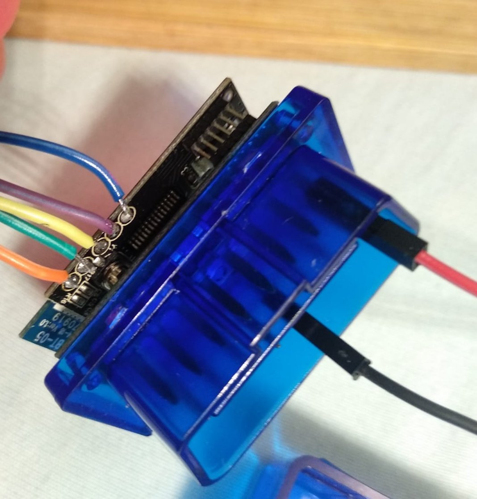

# Replace ELM327 firmware

This document describes how to replace ELM327 adapter firmware

### Hardware Requirements:

* ELM327 adapter with PIC18F25K80 chip. For the best models to buy from aliexpress, search PIC18F25K80 ELM37 and refer to https://github.com/uholeschak/ediabaslib/issues/39
* PICkit 3 or 4 programmer
* 12V power supply to power ELM327 adapter via OBD2 connector

### ELM327 board connections:

[](hc04-pinout.jpg)

From left to right: `MCLR` (orange), `5V` (green), `GND` (yellow), `PGD` (purple), `PGC` (blue)

## Step1: Get the needed software:

**Option 1 (Recommended):**
1. Download [MPLAB X IDE](https://www.microchip.com/mplab/mplab-x-ide) and install it, start MPLAB X IPE and select device `PIC18F25K80`.
2. Go to the Step2.

**Option 2:**
1. Download and install the [PICkit™ 3 Programming App and Scripting Tool v3.10](https://microchipdeveloper.com/pickit3:scripttool)
2. Edit the `PICkit3.ini` in the folder where the tool has been installed and add the following lines to the end of it:
```
TMEN:
REVS: Y
```
3. Download the File `PKPlusDeviceFile.dat` from https://sourceforge.net/projects/pickit3plus/
4. Delete original `PK2DeviceFile.dat` in the tool folder, and rename `PKPlusDeviceFile.dat` to `PK2DeviceFile.dat`
5. Start PICkit 3 v3.01

## Step2: Program PIC18F25K80
* Connect your PICkit 3/4 to the test points on the board of ELM327 adapter (see photo above)
* Connect 12V (pin 16) and GND (pin 4) from power supply to ELM327 ODB2 connector: https://www.obd-2.de/stecker-belegungen.html
* Take `CanAdaapterElm.X.production.unified.hex` from `hc04` folder of the [latest binary](https://github.com/uholeschak/ediabaslib/releases/latest) package
* Try to flash CanAdaapterElm.X.production.unified.hex. If it fails with the error "Cannot flash Device-ID", then edit it using Tools->Testmemory to the value in the original hex-file

## Step3: Testing
* Repower Elm327 adapter, connect to it over bluetooth and make a pair with it (standard PIN: `1234`)
* Connect to the bluetooth COM port assigned to the paired device on PC or use Serial Bluetooth Terminal for Android in HEX mode
* When sending strings to the adapter you should at least get an echo from the adapter, otherwise there is a problem with the connections.
Try to read ignition pin state with the following command (hex values):  
`82 F1 F1 FE FE 60`
The response should be:
`82 F1 F1 FE FE 60 82 F1 F1 FE <state> <checksum>` where bit 0 of `<state>` will be set to 1 if ignition is on.
