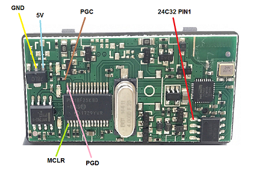
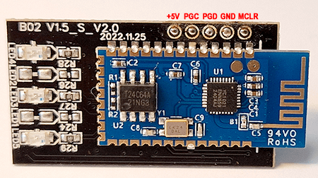

# Replace ELM327 BT V1.5 HW: V01_M_V2.3 adapter firmware (or equivalent)

This chapter describes how to replace the ELM327 BT V1.5 HW: V01_M_V2.3 adapter PIC18F25K80 firmware and YC1021 BT settings.  

### Requirements:

* [ELM327 BT V1.5 HW: V01_M_V2.3 adapter](https://www.aliexpress.com/item/New-OBDII-Diagnostic-Interface-Super-ELM327-Bluetooth-V1-5-Hardware-PIC18F25K80-Chip-1PCB-Board-ELM-327/32846998449.html) (or equivalent)
* EZP2010/TL866II Plus/CH341A Eeprom programmer with SOIC8 (150mil) programming clip
* PicKit 3/4 (to program the PIC18F25K80)

### ELM327 BT V1.5 HW: V01_M_V2.3 board connections:

### ELM327 BT V1.5 HW: V1.5_S_V2.0 board connections:

## Step1: Program the YC1021 BT settings
* Connect your EZP2010 or TL866II Plus or CH341A Eeprom programmer clip on to the SOIC8 (150mil) 24C32 / 24C64 eeprom chip, take note of orientation (red wire of clipon goes to red annotated 24C32 pin1)
* Do a full read with eeprom powered from programmer (do not apply power from obd side).  
  It's recommended that you disconnect VCC pin 8 of the 24C32 chip first!  
  It may take a few read tries to get the full dump correctly, if the first 0x80 bytes only contain 0xFF your read is incorrect.
* There are two EEPROM layout variants with an data offset of 0xB (original files `original_v1_.bin` and `original_v2_.bin`)
* EEPROM **24C32** layout variant 1 / 2:
  * BT address: 0x0F93 / 0x0F88 (6 bytes, normally keep unchanged)
  * BLE address: 0x0F99 / 0x0F8E (6 bytes, normally keep unchanged)
  * PinCode: 0x0F9F / 0x0F94, 1 byte length (max 15) and 15 byte PIN ASCII chars
  * BT 2.x name: 0x0FAF / 0x0FA4, 1 byte length (max 32) and 32 byte BT name ASCII chars
  * BLE name: 0x0FD0 / 0x0FC5, 1 byte length (max 24) and 32 byte BLE name ASCII chars
  * BaudRate: 0x0FF0 / 0x0FE5 (2 bytes, low byte first); default value: 0x04E2 is 38400 baud (for `default` PIC firmware), change to 0x01A1 for 115200 baud (for `def115200` or `yc1021` firmware)

* EEPROM **24C64** layout variant:
  * BT address: 0x18E3 (6 bytes, normally keep unchanged)
  * BLE address: 0x18E9 (6 bytes, normally keep unchanged)
  * PinCode: 0x18EF, 1 byte length (max 15) and 15 byte PIN ASCII chars (for some unknown reason some have 0000 but the adapter accepts only 1234)
  * BT 2.x name: 0x1900, 1 byte length (max 32) and 32 byte BT name ASCII chars
  * BLE name: 0x1920, 1 byte length (max 24) and 32 byte BLE name ASCII chars
  * BaudRate: 0x1940 (2 bytes, low byte first); default value: 0x04E2 is 38400 baud (for `default` PIC firmware), change to 0x01A1 for 115200 baud (for `def115200` or `yc1021` firmware)
* Optionally you may use the preconfigured settings file `modified_v1.bin` from the [latest binary](https://github.com/uholeschak/ediabaslib/releases/latest), if it's exactly matching your device firmware. **This is not recommended!**
* Write the changed binary back to the 24C32/24C64A eeprom (again powered from programmer, not from obd side).  

## Step2: Program the PIC18F25K80
* Connect your PicKit 3/4 to MCLR, PGD, PGC, GND (Vss) and 5V (Vcc) (take care, do not apply power from PicKit 3/4)
* Power the Elm327 adapter (from obd side)
* From subdirectory `CanAdapterElm` select either `default` (baudrate 38400), `def115200` (baudrate 115200) or `yc1021` firmware (recommended for non standard LED allocation) (baudrate 115200), always use `CanAdapterElm.X.production.unified.hex` for this first upload
* Flash the selected firmware to the PIC18F25K80

## Step3: Testing
* Power the Elm327 adapter
* Connect to XXYYZZ BT device and pair with it (standard pincode: 1234)
* Connect to the COM port assigned to your BT device
* When sending strings to the adapter you should at least get an echo from the adapter, otherwise there is a problem with the connections.  
You could test reading the ignition pin with the following command (hex values):  
`82 F1 F1 FE FE 60`  
The response is (additionally to the echo):  
`82 F1 F1 FE <state> <checksum>` with state bit 0 set to 1 if ignition is on.  
