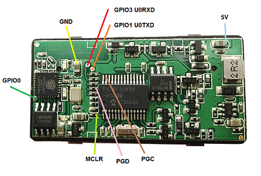

# Replace ELM327 Wifi V1.5 HW: V01W_M_V1.0 adapter firmware

This chapter describes how to replace the ELM327 Wifi V1.5 HW: V01W_M_V1.0 adapter PIC18F25K80 and ESP8266ex firmware.  

### Requirements:

* ELM327 Wifi V1.5 HW: V01W_M_V1.0 adapter
* Usb to serial with 3.3v I/O
* PicKit 3/4 (to program the PIC18F25K80)

### ELM327 Wifi V1.5 HW: V01W_M_V1.0 board connections:

## Step1: Program the ESP8266ex Soc
* Connect your Usb to serial (take care ESP8266ex is not 5v tolerant!) to U0RXD (connects to TX), U0TXD (connects to RX) and GND
* Connect GPIO0 to GND (this forces the ESP8266ex into bootloader on next bootup). The reset test point is not usable, because it's connected to an output signal on the board.
* Connect MCLR to GND to force the PIC18F in high-Z (you could also use the PicKit programmer to keep the processor in reset)
* Power the Elm327 adapter
* Flash ESP-link firmware to the ESP8266ex using the instructions for 8Mbit/1MByte flash from [ESP-link serial flashing](https://github.com/jeelabs/esp-link/blob/master/FLASHING.md#initial-serial-flashing)
* Command line for flashing: `python.exe esptool.py --port COMX --baud 460800 write_flash -fs 1MB -ff 40m 0x00000 boot_v1.X.bin 0x01000 user1.bin 0xfc000 esp_init_data_default.bin 0xfe000 blank.bin`
* Disconnect GPIO0 from GND (all others stay), Power cycle the Elm327 adapter, connect to `ESP_XXYYZZ` WiFi network.
* Using the browser, browse to `192.168.4.1`.
* At the _Home_ screen in the pin assignment set UART pins to `normal`, all other `disabled` and RX pull-up enabled.  
* Optionally set the Hostname to `deepobd`.
* At the _Services_ page remove the _SNTP_ server.
* Goto the _Debug log_ page, select _UART debug log_: `off`.
* Goto the _µC Console_, select _Baud_ `38400` for `default` PIC firmware and `115200` for `esp8266` firmware.
* Change the _SSID_ at the _WiFi Soft-AP_ page to `DeepOBD`, this is required for the `EdiabasLibConfigTool.exe` to work correctly.
* Optionally you could use preconfigured settings from the [latest binary](https://github.com/uholeschak/ediabaslib/releases/latest): `python.exe esptool.py --port COMX --baud 460800 write_flash 0x7e000 userdata.bin 0xfd000 sysdata.bin`
* **Hint: A power on reset is required before every single flash operation.**

## Step2: Program the PIC18F25K80
* Connect your PicKit 3/4 to MCLR, PGD, PGC, GND (Vss) and 5V (Vcc) (take care, do not apply power from PicKit 3/4)
* Power the Elm327 adapter
* From subdirectory `CanAdapterElm` select either `default` firmware when using baudrate 38400 (take care slightly misallocated led usage) or `wifi_esp8266ex (correct name/fill)` (recommended) when using 115200 baudrate, always use `CanAdapterElm.X.production.unified.hex` for this first upload
* Flash the selected firmware to the PIC18F25K80

## Step3: Testing
* Power the Elm327 adapter
* Connect to `ESP_XXYYZZ` WiFi network
* Telnet/Putty to 192.168.4.1 port 23 (use a program that allows hex display, send and receive)
* When sending strings to the adapter you should at least get an echo from the adapter, otherwise there is a problem with the connections.  
You could test reading the ignition pin with the following command (hex values):  
`82 F1 F1 FE FE 60`  
The response is (additionally to the echo):  
`82 F1 F1 FE <state> <checksum>` with state bit 0 set to 1 if ignition is on.  
Sending binary data with plink: `plink -raw 192.168.4.1 -P 23 < data.bin`  

## Using hotspot mode
Basically the ESP8266 could be configured via the web interface to automatically connect to an Android hotspot.  
If _[Deep OBD app](Deep_OBD_for_BMW_and_VAG.md)_ is working in hotspot mode (Hotspot active and WiFi off), the adapter IP assigned by the Android hotspot must be specified the app menu.  
Automatic detection of the adapter IP is not possible in this mode. You could see the devices connected to the Android hotspot in the Android hotspot menu.
