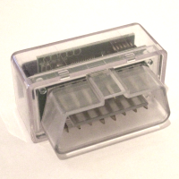

# Replacement firmware for ELM327
There is now a replacement firmware available for ELM327 based Bluetooth adapters, that has the following advantages over the standard firmware:
	* Faster and more stable CAN communication.
	* K-Line support (all protocols).
	* New: Support for the VAG protocols KWP2000, KWP1281, TP2.0 (cars until 4.2012).
	* Contains a bootstrap loader that allows firmware update without opening the device.
	* Firmware updates are possible with _[Deep OBD for BMW](Deep-OBD-for-BMW)_.
	* Reduced power consumption due to use of sleep mode.
	* Two firmware versions are available:
		* Unmodified Bluetooth adapter: Baud rate 38400.
		* Modified Bluetooth adapter (recommended) with replaced [OpenSource Bluetooth firmware](Custom-Bluetooth-firmware): Baud rate 115200 and alterable Bluetooth pin (16 digits) and name (31 chars).
 
## Buy an adapter
New adapters are available.
You could buy the [Bluetooth adapter](http://www.ebay.de/itm/252821147729) from EBAY.
For BMW F-models use the [ENET WiFi Adapter](ENET-WiFi-Adapter).
## Factory reset
Beginning with firmware version 0.6 there is the possibility to perform a factory reset of the adapter. This resets the Bluetooth pin to 1234, the Bluetooth name to Deep OBD BMW and the mode to D-CAN.
To perform the factory reset you have to open the adapter and connect the unused pad of R26 with GND during power on.
## Use the adapter with INPA, Tool32 or ISTA-D
You could use the Bluetooth adapter on a windows PC with INPA, Tool32 or ISTA-D as a replacement for an OBD or ADS adapter. The following steps are required to establish the connection:
# Install [.NET framework 4.0](https://www.microsoft.com/de-de/download/details.aspx?id=17718) or higher and [VS2015 C++ runtime](https://www.microsoft.com/de-de/download/details.aspx?id=48145) (recommended, but not required)
# Download the latest _Binary_ package and extract the .zip file. Start _Api32\EdiabasLibConfigTool.exe_ and follow the instructions in the status window: Search the adapter, select it, click _Check Connection_ and patch the required EDIABAS installations.
# For ISTA-D: You have to select the _EDIABAS\bin_ directory inside ISTA-D first.
# For ISTA-D: In _Administration_ -> _VCI Config_ select as _Interface type_: _Ediabas default settings (ediabas.ini)_

## Programming of the processor
For the first programming of the processor simply attach a PICKit 3 programmer to the corresponding test points of the circuit board.
The source for the firmware could be found in the subdirectory _CanAdapterElm_. In this subdirectory there is also a flash tool (subdirectory _UpdateLoader_) that allows firmware updates using the bootstrap loader once the firmware is programed.
The latest firmware version will be always included in _[Deep OBD for BMW](Deep-OBD-for-BMW)_.