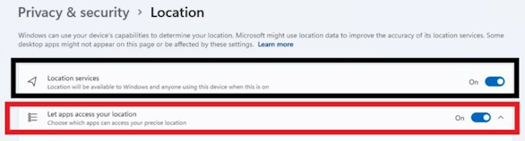

# Replacement firmware for ELM327
There is now a replacement firmware available for ELM327L based Bluetooth and WiFi adapters, that has the following advantages over the standard firmware:
* Faster and more stable CAN communication.
* K-Line support (all protocols).
* New: Support for the VAG protocols KWP2000, KWP1281, TP2.0 (cars until 4.2012).
* Contains a bootstrap loader that allows firmware update without opening the device.
* Firmware updates are possible with the _[Deep OBD app](Deep_OBD_for_BMW_and_VAG.md)_, if the replacement firmware [has already been programmed](#programming-of-the-processor).
* Reduced power consumption due to use of sleep mode.
* Flashing of a modified [ELM327 firmware](#elm327-firmware) is possible.
* Two firmware versions are available:
  * Unmodified Bluetooth and WiFi adapter: Baud rate 38400.
  * Modified Bluetooth adapter (recommended) with replaced [OpenSource Bluetooth firmware](Custom_Bluetooth_firmware.md): Baud rate 115200 and alterable Bluetooth pin (16 digits) and name (31 chars).

 

## Buy a standard Bluetooth adapter
It is required to buy adapters based on a PIC18F25K80 microcontroller.  
Search for `PIC18F25K80 ELM327` on Aliexpress. It's best to buy it with a Bluetooth module based on a _CSR BC417_ chip. The ones with _BK3231_ chip are supported too.  
For programming the firmware see: [programming](#programming-elm327-adapter-with-deep-obd-firmware)

## Buy a preprogrammed adapter
You could buy the preprogrammed [Bluetooth adapter](https://www.ebay.de/itm/256599171440) also at EBAY.  
There are also [Deep OBD OBD-II bluetooth adapters](https://shop.ibus-app.de/detail/index/sArticle/258) for BMW vehicles types `E36`, `E38`, `E39`, `E46`, `E52`, `E53`, `E83` , `E85`, `E86` with a fixed pin 7 + 8 connection available.  
Adapters from these links include a **license** for the [BMW coding](BMW_Coding.md) function of one F series or higher vehicle.  

Vehicles `E36`, `E38`, `E39`, `E46`, `E52`, `E53`, `E83` , `E85` and `E86` additionally require a connection between OBD pin 7 and 8 (or a pin7-pin8 adapter) to access all ECUs.  
For vehicles with OBD I socket in the engine bay additionally the pin 8 of the OBD II socket has to be connected at the vehicle side ([`OBD1-OBD2.pdf`](OBD1-OBD2.pdf))!  
_Hint:_ For some Android radio models the Bluetooth name `OBDII` is required for pairing!  
_Hint:_ To prevent entering Bluetooth PIN manually on the android smartphone you could use the app [Bluetooth Force Pin Pair](https://play.google.com/store/apps/details?id=com.solvaig.forcepair) and configure the PIN accordingly.  
For BMW F-models use the [ENET WiFi Adapter](ENET_WiFi_Adapter.md).

## Factory reset
Beginning with firmware version 0.6 there is the possibility to perform a factory reset of the adapter. This resets the Bluetooth pin to 1234, the Bluetooth name to Deep OBD BMW and the mode to D-CAN.  
To perform the factory reset you have to open the adapter and connect the unused pad of R26 with GND during power on.  
If the firmware updated failed, use [firmware update failure](#firmware-update-failure) procedure.

## Use the adapter with INPA, Tool32 or ISTA-D
You could use the Bluetooth adapter on a windows (10 or higher) PC (with INPA, Tool32 or ISTA-D) as a replacement for an OBD or ADS adapter. The following steps are required to establish the connection:
* Install [.NET Framework 4.8 Runtime](https://dotnet.microsoft.com/en-us/download/dotnet-framework/net48) or higher, [.NET 10.0 Desktop Runtime](https://dotnet.microsoft.com/en-us/download/dotnet/10.0),  
and [VS C++ Runtime 64 bit](https://aka.ms/vs/17/release/vc_redist.x64.exe) or [VS C++ Runtime 32 bit](https://aka.ms/vs/17/release/vc_redist.x86.exe).
* For Windows 11: Allow location access for all apps in the system settings to enable WiFi access. 
* Download the [latest binary](https://github.com/uholeschak/ediabaslib/releases/latest) package and extract the .zip file. Start `EdiabasLibConfigTool\EdiabasLibConfigTool.exe` and follow the instructions in the status window: Search the adapter, select it, click `Check Connection` and patch the required EDIABAS installations.
* For ISTA-D: You have to select the `EDIABAS\bin\api32.dll` inside ISTA-D first.  

* For ISTA-D: In _Administration_ -> `VCI Config` select as `Interface type`: `Ediabas default settings (ediabas.ini)`  
For programming the option 'HO-ICOM / ENET local network' is required, which is only available for LAN connections. This option is only working with LAN and not with D-CAN connections!

## Programming ELM327 adapter with Deep OBD firmware
First programming of PIC18F25K80 microcontroller should be done with a PICkit 3 programmer. Here is instruction for [flashing ELM327 adapter with Deep OBD firmware](Replace_ELM327_HC04_Firmware.md).

The source for the firmware could be found in the subdirectory `CanAdapterElm`.  
If not explicitly specified, default LED layout is: (RX LED: PB6, TX LED: BP7).  
The subdirectory names below are the Bluetooth chip types:
* `default`: For unmodified ELM327L adapter with any Bluetooth chip. Baud rate 38400
* `def115200`: For ELM327L adapter with any Bluetooth chip but modified baud rate 115200 (E.g. external YC1021 with modified EEPROM)
* `bc04`: For adapter with BK3231 Bluetooth chip and bc04 firmware
* `hc04`: For adapter with BC417 Bluetooth chip and hc04, hc05 and hc06 firmware
* `hc06`: For adapter with BC417 BLE (Bluetooth Low Energy) chip and hc06 firmware
* `esp8266`: For adapter with ESP8266 WiFi chip (RX LED: PB5, TX LED: BP7) [Replace ESP8266ex firmware](Replace_Elm327_Wifi_Mini_Firmware.md)
* `yc1021`: For adapter with integrated YC1021 Bluetooth chip (RX LED: PB6, TX LED: BP4) [Replace YC1021 firmware](Replace_Elm327_BT_Mini_Firmware.md)
* `spp_uart` and `spp_uart2` (RX LED: PB6, TX LED: BP4): [OpenSource Bluetooth firmware](Custom_Bluetooth_firmware.md) for adapters with BC417 Bluetooth chip (recommended for old Android car radios with Rockchip platform)
  * `spp_uart.xpv` and `spp_uart.xdv`: Firmware for Bluetooth module with BC417 chipset
  * `usbspi.dll`: This is a replacement library for _BlueSuite_ and _BlueLab_ for programming CSR BC03/BC04 Bluetooth chipsets via FT232R breakout boards. For more information see the [`ReadMe.txt`](../EdiabasLib/CanAdapterElm/Bluetooth/spp_uart/ReadMe.txt) file.

There are two firmware files, the complete file (`CanAdapterElm.X.production.unified.hex`) and the update file (`CanAdapterElm.X.production.hex`) without bootloader, that is only needed by the _[Deep OBD app](Deep_OBD_for_BMW_and_VAG.md)_.  
The latest firmware version will be always included in the _[Deep OBD app](Deep_OBD_for_BMW_and_VAG.md)_.  
Also you can get compiled firmware files from the [latest binary](https://github.com/uholeschak/ediabaslib/releases/latest) package.

## ELM327 firmware
There is improved ELM327 V2.3 compatible firmware available. It switches adapter to a mode compatible with most ELM327 software. 
Flashing can be done over bluetooth with the _[Deep OBD app](Deep_OBD_for_BMW_and_VAG.md)_ (at the moment this is only available for Bluetooth adapters).
Afterwards you can flash the Deep OBD replacement firmware over Bluetooth firmware again.  
Binariy files (complete `ELM327V23.X.production.unified.hex`) and (update `ELM327V23.X.production.hex`) could also found in the the [latest binary](https://github.com/uholeschak/ediabaslib/releases/latest) package.

## Firmware update failure
If the firmware update or switching to the ELM327 firmware fails, all LEDs are active and the adapter stops in the bootloader mode.  
In this state it's possible to retry the update in the adapter menu of the _[Deep OBD app](Deep_OBD_for_BMW_and_VAG.md)_ after reconnecting the adapter and ignoring the error message.
